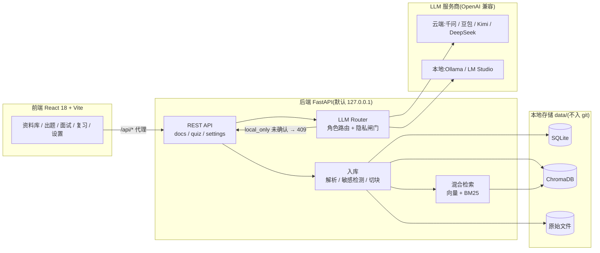

# Whetstone(磨刀石)


基于个人资料(简历、项目文档、学习笔记)的 RAG 面试陪练智能体:整理资料 → 检索取证出题 → 模拟面试与评分 → 薄弱点间隔复习。LLM 层支持多服务商自由切换(千问 / 豆包 / Kimi / DeepSeek / Ollama 等,国内厂商优先),隐私优先,数据默认不出本机。

## ✨ 功能特性

**✅ 已实现**

- **多服务商 LLM 抽象层** — 统一 `openai_compatible` 协议,预置千问 / 豆包 / Kimi / DeepSeek / Ollama,任意 OpenAI 兼容接口均可经设置页添加;模型名一律可配置不写死;结构化输出带能力降级链。
- **资料整理入库** — PDF(PyMuPDF)/ Markdown 解析,敏感信息检测,切块向量化后存入 ChromaDB;同一文件重复上传自动跳过,支持一键重建索引(嵌入模型更换时自动重嵌入)。
- **混合检索** — 向量 + BM25 融合取 Top5,`personal` / `reference` 双集合;题目与证据均可溯源到具体文件的 file / section。
- **多服务商设置页** — 服务商增删改、连通性实测(list_models)、角色路由在线调整;接口永不回传明文 Key。
- **API 与前端骨架** — FastAPI 20 个端点(资料 / 会话 / 设置);React 18 + Vite + TypeScript 严格模式 + Tailwind v4,7 个页面路由;前端构建产物可由后端直接托管。

**🚧 进行中**

- **出题智能体** — 能力矩阵(岗位归一 → JD 关键词命中 → A/B/C/D 分级)→ 检索取证 → 结构化生成 + 余弦相似度去重闸门;生成与去重代码已就绪,API 接线中(端点暂返回 501)。
- **评分智能体** — 对照参考答案与关键点,按行业包 rubric 维度加权打分、提取遗漏点;代码已就绪,同样待接线。
- **复习闭环(后端)** — 按得分间隔排期(<60 分 1/3/7 天、60–79 分 3/7 天、≥80 分 7 天),今日复习队列查询 API 已可用;前端看板未接。

**📋 规划中**

- **模拟面试** — 多轮追问链、SSE 流式输出、总结报告(`interview` 角色路由已预留)。
- **复习看板前端**、更多行业包(财会金融 / 教师 / 医疗 / 体制内等)、国家职业技能标准接入。

## 🏗️ 架构



- **多服务商切换**:`extract` / `generate` / `evaluate` / `interview` / `embed` 五个角色独立路由,每个角色可绑定不同厂商与模型(如"评分用 DeepSeek、嵌入用本地 Ollama"),改 `settings.yaml` 或设置页即可,不重启代码。
- **隐私路由**:命中敏感模式的内容默认 `local_only`,仅本地推理;确需发云端时,后端返回 409,前端弹知情确认后携带 `confirm_cloud=true` 重发,后端校验通过才放行。

## 🚀 快速开始

前置要求:**Python 3.11+**、**Node 18+**、[uv](https://docs.astral.sh/uv/)(推荐),以及任一服务商 API Key(或本地 Ollama,无需 Key)。

```bash
git clone https://github.com/<your-name>/whetstone-agent.git
cd whetstone-agent

# 后端
cd backend
cp .env.example .env.development   # Windows PowerShell 用 copy;填入至少一个真实 Key
uv sync
uv run uvicorn src.api.main:app --host 127.0.0.1 --port 8000

# 前端(另开一个终端)
cd frontend
npm install
npm run dev
```

- 前端地址:<http://localhost:5173>(Vite 已把 `/api/*` 代理到后端,无跨域问题)
- API 文档(Swagger):<http://127.0.0.1:8000/docs>
- 不启动前端也可用命令行验证核心链路:

```bash
cd backend
uv run python -m scripts.p0_check path/to/简历.pdf   # 入库 → 检索 → 带出处问答
```

## ⚙️ 配置说明

**环境变量与 Key**(`backend/.env.development` 本地 / `.env.production` 服务器,由 `APP_ENV` 决定加载哪个;两类文件均已被 `.gitignore` 排除,仓库只提交 `.env.example`):

| 环境变量 | 对应服务商 |
| --- | --- |
| `DASHSCOPE_API_KEY` | 千问(阿里云百炼) |
| `ARK_API_KEY` | 豆包(火山方舟) |
| `MOONSHOT_API_KEY` | Kimi(Moonshot) |
| `DEEPSEEK_API_KEY` | DeepSeek |

Ollama / LM Studio 等本地厂商不需要 Key。

**角色路由**(`backend/config/settings.yaml` 的 `routing` 段,或设置页 `PUT /api/settings/routing`):

| 角色 | 用途 | 默认示例 |
| --- | --- | --- |
| `extract` | 简历 / 项目证据抽取 | qwen · qwen-plus |
| `generate` | 出题 | qwen · qwen-plus |
| `evaluate` | 作答评分 | qwen · qwen-plus |
| `interview` | 模拟面试追问(预留) | qwen · qwen-plus |
| `embed` | 文档向量化 | qwen · text-embedding |

嵌入维度记录在向量库元数据中,更换嵌入模型需在设置页或 `POST /api/docs/reindex` 重建索引。

**支持的服务商**:预置 qwen / doubao / kimi / deepseek(云端)与 ollama / lm_studio / qianfan(预设条目);一切 OpenAI 兼容接口都能通过设置页以自定义 `base_url` 接入。

**行业包**(`backend/packs/`):每个包含 `pack.yaml`(题族 + 能力库)、`rubric.yaml`(评分维度)与 `prompts/`(出题、追问提示词)。内置 `_core`(通用:自我介绍、STAR 行为、求职动机等)与 `tech`(互联网/IT:原理、场景、系统设计、项目深挖等),按 `pack_id` 加载,可自行扩展新行业。

## 🔒 隐私与安全

- **默认只监听 `127.0.0.1`**(host 在代码中固定)。如需公网部署,必须自行配置反向代理 + HTTPS + 访问认证,风险自负(参考 `GET /api/settings/keyring-hint` 返回的部署提示)。
- **敏感检测与知情确认**:上传文档自动检测手机号 / 邮箱 / 身份证 / 银行卡(模式见 `config/settings.yaml`),命中即默认标记 `local_only`;发送给云端厂商前强制知情确认。本地厂商不受此限制。
- **Key 只存本机**:仅保存在本机 `.env.*` 文件或系统环境变量,不写入任何提交文件;设置相关接口只返回"已设置 / 未设置",绝不回传明文。
- **数据不出本机**:SQLite、向量库、原始文档全部存放在 `data/` 目录,该目录已被 `.gitignore` 排除。

## 📁 项目结构

```text
whetstone-agent/
├── backend/
│   ├── .env.example               # 环境变量模板(复制为 .env.development 后填 Key)
│   ├── config/
│   │   ├── providers.yaml         # 服务商预置(base_url / Key 环境变量名)
│   │   └── settings.yaml          # 角色路由 / 切块与检索参数 / 隐私检测模式
│   ├── packs/
│   │   ├── _core/                 # 通用行业包(所有岗位)
│   │   └── tech/                  # 互联网/IT 行业包
│   ├── scripts/p0_check.py        # 命令行验收:入库 → 检索 → 带出处问答
│   ├── src/
│   │   ├── llm/                   # 多服务商抽象:registry / router(隐私闸门)/ openai_compat / 结构化输出
│   │   ├── ingest/                # PDF·MD 解析、敏感检测、切块、能力画像
│   │   ├── retrieval/             # ChromaDB 向量库 + BM25 混合检索
│   │   ├── occupation/            # 岗位归一 + 能力矩阵(JD 关键词 → A/B/C/D 分级)
│   │   ├── agents/                # generator(出题 + 去重闸门)/ evaluator(评分 + 复习排期)
│   │   ├── api/                   # FastAPI 路由:docs / quiz / settings
│   │   ├── packs_loader.py        # 行业包加载
│   │   └── config.py / db.py      # 全局配置 / SQLite
│   └── tests/                     # pytest:api / generator / ingest / llm
├── frontend/
│   └── src/
│       ├── pages/                 # 资料库 / 知识档案 / 目标岗位 / 出题练习 / 模拟面试 / 复习看板 / 设置
│       ├── components/            # CloudConfirmDialog(云端知情确认弹窗)等
│       └── api/                   # fetch 封装 + 最小类型
├── data/                          # 运行时数据(gitignore):app.db / vectorstore/ / raw/
└── LICENSE                        # Apache-2.0
```

## 🗺️ 路线图

| 阶段 | 内容 | 状态 |
| --- | --- | --- |
| **P0** | LLM 抽象层 + 解析入库 + 检索问答 | ✅ 已完成 |
| **P1** | 岗位解析 + 出题 + 前端骨架 | 🚧 **当前阶段**(能力矩阵、出题/评分智能体与检索链路已就绪,API 接线中) |
| **P2** | 评分接入 + 设置页完善 | 🚧 设置页服务商管理与角色路由已上线 |
| **P3** | 模拟面试:多轮追问、SSE 流式、总结报告 | 📋 规划中 |
| **P4** | 复习闭环:薄弱点统计、复习队列、看板 | 📋 排期算法与队列 API 已有雏形 |
| **P5** | 扩展与打磨:行业包扩充、职业标准接入、anthropic/gemini 适配器、检索重排调优、评测集 | 📋 持续推进 |

## 📄 License

本项目基于 [Apache License 2.0](LICENSE) 开源。
