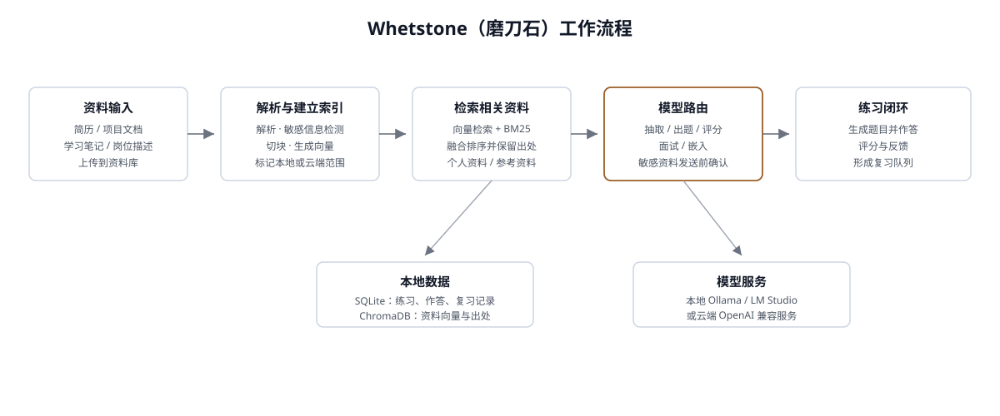

# Whetstone（磨刀石）


> **Whetstone 是一个本地优先的个人面试与学习陪练工具：把简历、项目文档和笔记变成可检索的证据，再用于出题、评分和复习。**

项目面向希望掌控个人资料与模型服务商选择的求职者、学习者和个人开发者。它不是通用的公开面试平台，也不要求把所有资料上传到同一个云端服务。

## 它帮你解决什么

面试准备通常不是“没有资料”，而是资料太多、太散，却很难真正用起来：

- **资料散落各处**：简历、项目复盘、学习笔记和岗位描述分开保存，想找某段经历时要反复翻文件。
- **练习题不贴合自己**：网上的通用题很多，但很少围绕你的项目经历和目标岗位追问，也看不出题目依据哪份资料。
- **答完就结束了**：知道自己答得不好，却没有记录具体漏了什么，也没有下一次复习的安排。
- **不敢随便上传隐私资料**：简历里可能有手机号、邮箱等信息，很难确认哪些内容会被发送给云端模型。
- **更换模型不方便**：不同模型的接口和能力不同，切换服务商时常常要重新改代码或配置。

Whetstone 把这条准备流程串起来：

1. 把简历、项目文档、笔记等资料集中保存并建立索引；
2. 根据资料和目标岗位找到相关证据，生成有出处的练习题；
3. 记录你的回答，给出反馈，并把需要加强的内容安排到后续复习；
4. 对包含敏感信息的资料默认优先本地处理，使用云端模型前先明确征得你的同意；
5. 允许你在配置中选择不同的模型服务商，而不把模型写死在程序里。

当前项目更适合**个人在本机使用和验证功能**，不包含多用户、账号体系或生产级公网部署能力。

## 核心能力

### 已实现

- **资料入库与索引**：支持 PDF、Markdown 等资料上传；解析、敏感信息检测、切块、嵌入后写入本地 SQLite 与 ChromaDB。相同文件可跳过重复处理，也可重建索引。
- **混合检索**：同时使用向量检索与 BM25，在 `personal`（简历、项目、笔记）和 `reference`（参考资料）两个集合中检索，并融合返回结果；结果保留文件名和章节出处。
- **可配置 LLM 路由**：通过 `extract`、`generate`、`evaluate`、`interview`、`embed` 五个角色分别选择服务商和模型。当前适配器类型为 `openai_compatible`，可连接预置服务商或任意兼容接口。
- **隐私闸门**：手机号、邮箱、身份证号、银行卡号等命中规则的资料默认标记为 `local_only`；若请求需要发送到云端，后端先返回 `409`，前端展示知情确认后才能继续。
- **出题与去重**：基于能力项、岗位描述和检索证据生成结构化题目，题目包含关键点、难度、追问和出处，并用余弦相似度过滤重复题。
- **作答评分与复习排期**：对照参考答案和行业包 rubric 评分，返回维度分、反馈和遗漏点；根据分数生成 1/3/7 天复习队列，并提供今日复习 API。
- **练习会话管理**：支持创建、查看、删除和 JSON 导出 quiz/interview 会话，以及题目和作答记录的持久化。
- **服务商设置**：设置页/API 支持服务商增删改、`list_models` 连通性测试和角色路由调整；接口只返回 Key 是否设置，不回传明文 Key。
- **前端工作台**：React 18 + Vite + TypeScript + Tailwind CSS，包含资料库、知识档案、目标岗位、出题练习、模拟面试、复习和设置等页面入口。

## 工作流程与架构

典型的资料到练习流程如下：



一次出题请求大致经过以下步骤：

1. 资料先被解析、检测敏感信息并切块，嵌入后保存到本地向量库；
2. 根据能力项、岗位描述和行业包计算题量，再到个人资料和参考资料集合中检索证据；
3. `generate` 角色生成带出处的结构化题目，去重闸门过滤与已有题目过于相似的结果；
4. 用户提交答案后，`evaluate` 角色按行业包 rubric 评分，并将复习到期日写入 SQLite；
5. 每个角色均经过 Router 选择实际服务商；敏感资料发送云端前必须显式确认。

## 功能边界与当前状态

仓库当前的代码状态应按以下边界理解：

- **出题和评分后端链路已可用**：相关 API 已连接 generator/evaluator，并有不联网的假服务商测试覆盖。
- **资料上传不会自动完成能力声明抽取**：代码中已有能力声明的数据模型和 LLM 抽取器，但当前上传 API 主要负责解析、检测、切块和索引；出题 API 需要数据库中已有 `profile_claims` 能力声明。知识档案页可以读取已有声明，但“上传后自动生成完整知识档案”尚未形成端到端流程。
- **目标岗位页仍是前端演示**：岗位归一、能力矩阵和 A/B/C/D 分类有规则实现与测试，但当前没有对应的 JD API 接口，页面使用示例数据。
- **模拟面试页仍是交互占位**：页面可以演示对话界面，但后端尚未提供多轮面试接口、SSE 流式追问和总结报告。
- **复习 API 已有，复习看板尚未接入真实数据**：`GET /api/quiz/review/today` 可返回到期题目；前端复习页仍使用占位数据。
- **PDF 扫描件暂不做 OCR**：系统可以识别疑似扫描 PDF 并提示，但无法从没有文本层的扫描件中提取内容。
- **当前适配器只有 OpenAI 兼容协议**：服务商可配置和切换，但没有各云厂商的专用 SDK 适配器；BM25 当前在内存中构建，适合个人资料规模，不是面向大规模数据集的检索服务。

## 快速开始

### 环境要求

- Python 3.11+
- Node.js 18+
- [uv](https://docs.astral.sh/uv/)（推荐用于后端依赖管理）
- 至少一个可用的 OpenAI 兼容服务商；也可以只使用本地 Ollama/LM Studio

### 1. 获取代码并启动后端

```bash
git clone https://github.com/fmk618/whetstone-agent.git
cd whetstone-agent

cd backend
```

复制环境变量模板。Windows PowerShell 可执行：

```powershell
Copy-Item .env.example .env.development
```

macOS/Linux 可执行：

```bash
cp .env.example .env.development
```

编辑 `backend/.env.development`，填入至少一个云端服务商 Key；使用本地服务商时可保持 Key 为空。然后安装依赖并启动 API：

```bash
uv sync
uv run uvicorn src.api.main:app --host 127.0.0.1 --port 8000
```

### 2. 启动前端

另开一个终端，在项目根目录执行：

```bash
cd frontend
npm install
npm run dev
```

打开：

- 前端：<http://localhost:5173>
- FastAPI 文档：<http://127.0.0.1:8000/docs>

开发服务器会把前端的 `/api/*` 请求代理到 `127.0.0.1:8000`。构建前端后，若 `frontend/dist/` 存在，FastAPI 也会直接托管该目录。

### 3. 验证核心检索链路

配置好服务商后，可以用命令行验证“解析 → 入库 → 检索 → 带出处问答”：

```bash
cd backend
uv run --python 3.11 python -m scripts.p0_check path/to/resume.pdf
# 或
uv run --python 3.11 python -m scripts.p0_check path/to/notes.md
```

检测到敏感信息时，命令行会在发送云端前要求确认；疑似扫描 PDF 会提示当前版本没有 OCR。

## 配置、隐私与安全

### 服务商与角色路由

- `backend/config/providers.yaml` 保存服务商 ID、兼容接口地址和 Key 对应的环境变量名；默认预置千问、豆包、Kimi、DeepSeek、Ollama，并提供 Qianfan、LM Studio 等预设地址。
- `backend/config/settings.yaml` 的 `routing` 段配置角色与模型，例如：

  ```yaml
  routing:
    generate: { provider: qwen, model: qwen-plus }
    evaluate: { provider: ollama, model: your-local-model }
    embed: { provider: qwen, model: your-embedding-model }
  ```

- 模型名称不写死在代码中。也可以通过设置页对应的 API 修改服务商和角色路由。
- `.env.development`、`.env.production` 等文件只在本机加载，并已被 `.gitignore` 排除。可用变量包括 `DASHSCOPE_API_KEY`、`ARK_API_KEY`、`MOONSHOT_API_KEY` 和 `DEEPSEEK_API_KEY`。

### 默认的数据与隐私策略

- 默认监听 `127.0.0.1:8000`，运行时数据库、原始文件和 ChromaDB 位于项目根目录的 `data/`，该目录不提交到 Git。
- 上传内容会按 `backend/config/settings.yaml` 中的规则检测手机号、邮箱、身份证号和银行卡号。命中后默认标记 `local_only`；发送到云端需要通过 `confirm_cloud=true` 完成知情确认。
- Key 只从环境变量或本机配置读取；设置接口只返回“已设置/未设置”，不会把明文 Key 返回给前端。
- 若要公网部署，必须自行配置 HTTPS、反向代理和访问认证，并将 Key 放在服务端环境变量或安全的密钥管理系统中；当前项目默认配置不是多用户生产部署方案。
- 本项目不保证第三方模型服务商的留存、训练或跨境策略。使用云端服务前，请自行阅读对应服务商的隐私条款。

## 项目结构

```text
whetstone-agent/
├── backend/
│   ├── .env.example              # 环境变量模板
│   ├── config/
│   │   ├── providers.yaml        # OpenAI 兼容服务商预置
│   │   └── settings.yaml         # 角色路由、切块、检索、隐私规则
│   ├── scripts/
│   │   └── p0_check.py           # 解析、入库、检索、带出处问答验收
│   ├── src/
│   │   ├── api/                  # FastAPI 入口及 docs/quiz/settings 路由
│   │   ├── agents/               # 出题、去重、评分、复习排期
│   │   ├── ingest/               # 文件解析、切块、敏感检测、能力模型
│   │   ├── llm/                  # Provider、Router、结构化输出
│   │   ├── occupation/           # 岗位映射与能力矩阵规则
│   │   ├── retrieval/            # ChromaDB 与向量/BM25 混合检索
│   │   ├── config.py             # 环境与运行时路径配置
│   │   └── db.py                 # SQLite schema 与数据库封装
│   └── tests/                    # API、出题、入库、LLM 路由测试
├── frontend/
│   ├── src/
│   │   ├── api/                  # fetch 封装与接口类型
│   │   ├── components/           # 布局、提示、云端确认等组件
│   │   └── pages/                # 资料库、档案、岗位、练习、面试、复习、设置
│   ├── vite.config.ts            # Vite 开发服务器与 /api 代理
│   └── package.json              # 前端脚本与依赖
├── docs/
│   ├── architecture.svg         # README 使用的静态架构流程图
│   └── architecture-diagram.html # 独立浏览器版架构图
├── data/                         # 运行时数据，已被 gitignore 排除
└── LICENSE                       # Apache License 2.0
```

## 开发与测试

后端测试使用 pytest 和 pytest-asyncio，测试通过夹具替换 LLM/嵌入服务，不需要真实 API Key：

```bash
cd backend
uv sync
uv run --python 3.11 pytest -q
```

常用的定向测试：

```bash
uv run --python 3.11 pytest tests/test_api_quiz_flow.py -q
uv run --python 3.11 pytest tests/test_generator.py tests/test_ingest.py -q
```

前端类型检查和生产构建：

```bash
cd frontend
npm install
npm run build
```

`npm run build` 会先执行 `tsc --noEmit`，再运行 Vite 构建。开发时可使用 `npm run dev`，构建产物可使用 `npm run preview` 预览。

## 许可证

本项目基于 [Apache License 2.0](LICENSE) 开源。
